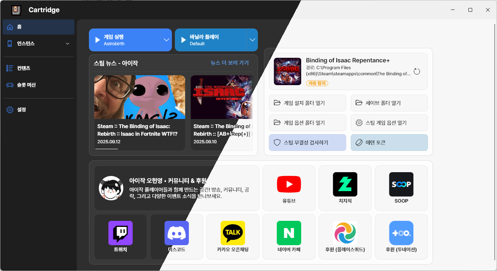

<h1 align="center">
   
  
   
  Cartridge
   
</h1>

<strong>Flutter-based Isaac Mod Manager for Windows</strong>

This program was developed for the streamer <b>Oh Hyeon-Young</b>. It includes several features tailored for broadcast/content workflows.

  <a href="./README.md"><b>한국어</b></a> • <a href="./README.en.md">English</a>

  
  
  

    <b>Community - </b>
    <a href="https://cafe.naver.com/iwt2hw"><b>Naver Cafe</b></a> •
    <a href="https://open.kakao.com/o/gXkuZvze"><b>KakaoTalk</b></a> •
    <a href="https://discord.gg/MrJ94bekzU"><b>Discord</b></a>

    <b>Streaming - </b>
    <a href="https://www.youtube.com/@아이작오헌영"><b>YouTube</b></a> •
    <a href="https://www.twitch.tv/iwt2hw"><b>Twitch</b></a> •
    <a href="https://ch.sooplive.co.kr/iwt2hw"><b>SOOP</b></a> •
    <a href="https://chzzk.naver.com/f409bd9619bb9d384159a82d8892f73a"><b>CHZZK</b></a>

    <b>Support - </b>
    <a href="https://pls.gg/iwt2hw"><b>PlaySquad</b></a> •
    <a href="https://ohy.kr/toon"><b>Toonation</b></a>

---

## Overview
Cartridge is a Windows desktop app that helps you create and switch between *The Binding of Isaac* mod combinations (presets) with ease. It automatically detects save/install/options folders and lets you open frequently used paths quickly.

## Key Features
- **Home**: Auto-detects major Isaac folders (save/install/options) and provides quick shortcuts
- **Instances/Presets Management**: Save and load various mod combinations
- **Content / Slot Machine**: Mini tools designed for broadcast/content use

## Screenshots

  

  

  

---

## Download

- Latest release: **[Releases (Latest)](https://github.com/TeamHY/cartridge/releases/latest)**
    - Windows **Installer EXE** (recommended): `Cartridge-Setup-x.y.z.exe`
    - Windows **Portable ZIP**: `cartridge-x.y.z.zip`

---

## Developer Setup
Contributing to the project? See the detailed setup guide in **[docs/dev-setup.md](./docs/dev-setup.md)**.

---

## Disclaimer & Trademarks

> *The Binding of Isaac* and related marks are the property of their respective owners. This tool is **unofficial** and not affiliated with the developer/publisher.
