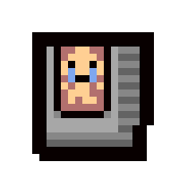
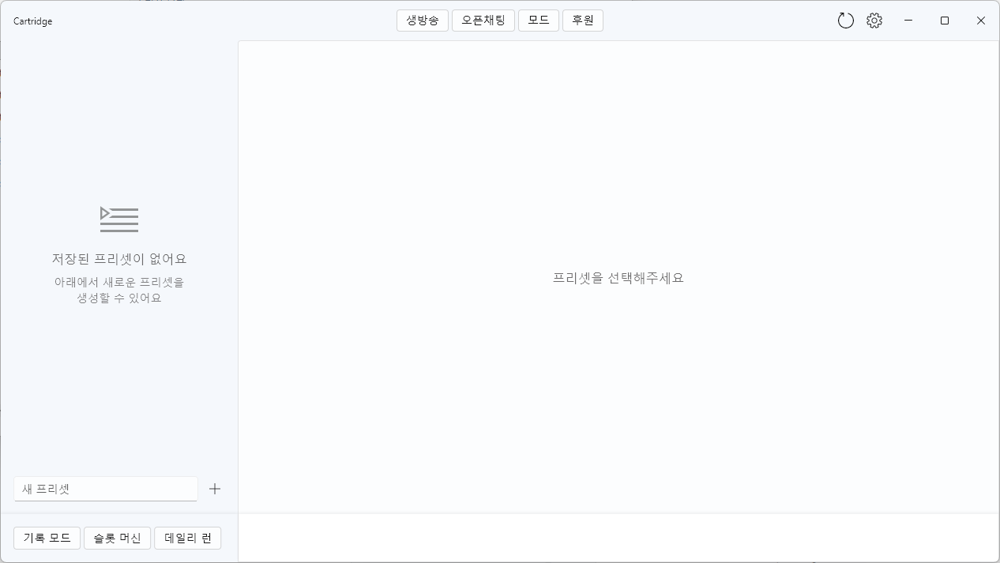
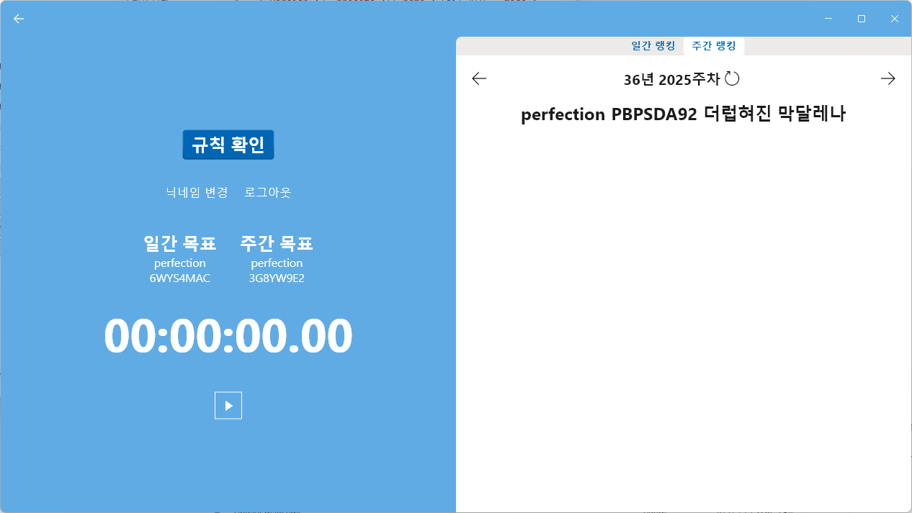
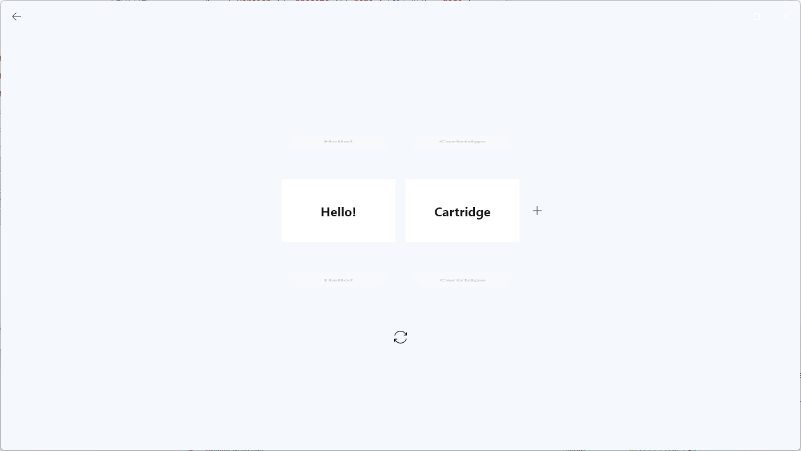

<h1 align="center">
   
  
   
  Cartridge
   
</h1>

<h4 align="center">Flutter 기반의 Isaac 프리셋 매니저 데스크톱 앱 (Windows)</h4>

이 프로그램은 방송인 <b>오헌영</b>님을 위해 개발되었습니다. 일반 사용자에게는 다소 특화된 기능이 포함되어 있을 수 있습니다.

  
  
  

    <b>커뮤니티 - </b>
    <a href="https://cafe.naver.com/iwt2hw"><b>네이버 카페</b></a> •
    <a href="https://open.kakao.com/o/gXkuZvze"><b>카카오톡</b></a> •
    <a href="https://discord.gg/MrJ94bekzU"><b>디스코드</b></a>

    <b>방송 - </b>
    <a href="https://www.youtube.com/@아이작오헌영"><b>YouTube</b></a> •
    <a href="https://www.twitch.tv/iwt2hw"><b>Twitch</b></a> •
    <a href="https://ch.sooplive.co.kr/iwt2hw"><b>SOOP</b></a> •
    <a href="https://chzzk.naver.com/f409bd9619bb9d384159a82d8892f73a"><b>CHZZK</b></a>

    <b>후원 - </b>
    <a href="https://pls.gg/iwt2hw"><b>PlaySquad</b></a> •
    <a href="https://ohy.kr/toon"><b>Toonation</b></a>

## 주요 기능

**cartridge**로 할 수 있는 일들:

* **프리셋 관리** — 여러 Isaac 모드 조합을 저장/불러오기

  

  

---

## 사용 방법 (How To Use)

Windows에서 실행하는 절차:

1) [Releases](https://github.com/TeamHY/cartridge/releases)에서 최신 ZIP 다운로드
2) 임의의 폴더(예: C:\Apps\cartridge)로 압축 해제
3) `cartridge.exe` 실행

> **참고**
> 본 앱은 GitHub Releases에서 배포되는 **서명되지 않은 Portable Flutter EXE**입니다. 공식 스토어/코드 서명/인증은 없습니다. 최초 실행 시 Windows **SmartScreen** 경고가 표시될 수 있습니다. Windows SmartScreen 경고가 표시되면 **자세히**를 클릭한 뒤 **실행(Execute anyway / Run anyway)** 를 선택하세요. 파일 출처를 반드시 확인하세요.

### 최초 설정

* **프리셋**을 만든 뒤 사용할 모드를 토글하고 저장하세요.

### 업데이트 / 삭제

* **업데이트**: 최신 ZIP으로 기존 폴더를 **교체**하세요(자동 업데이트 없음).
* **삭제(제거)**: 압축 해제한 폴더를 삭제하면 됩니다.  
  ※ 앱 폴더 삭제 시에도 프리셋/설정은 유지됩니다. (경로: %APPDATA%\TeamHY\cartridge)

---

## 다운로드 (Download)

* 최신 버전(Windows Portable ZIP): [https://github.com/TeamHY/cartridge/releases/latest](https://github.com/TeamHY/cartridge/releases/latest)

---

## 개발자 안내 (Developer Setup)

프로젝트에 기여하시나요? 개발 환경 초기 세팅 가이드는 [**docs/dev-setup.md**](./docs/dev-setup.md)에서 확인하세요.

---

> *상표 고지*: *The Binding of Isaac* 및 관련 마크는 각 소유자의 자산입니다. 본 도구는 **비공식**이며 제작사/배급사와 무관합니다. 프리셋 변경 전 반드시 백업하세요.
