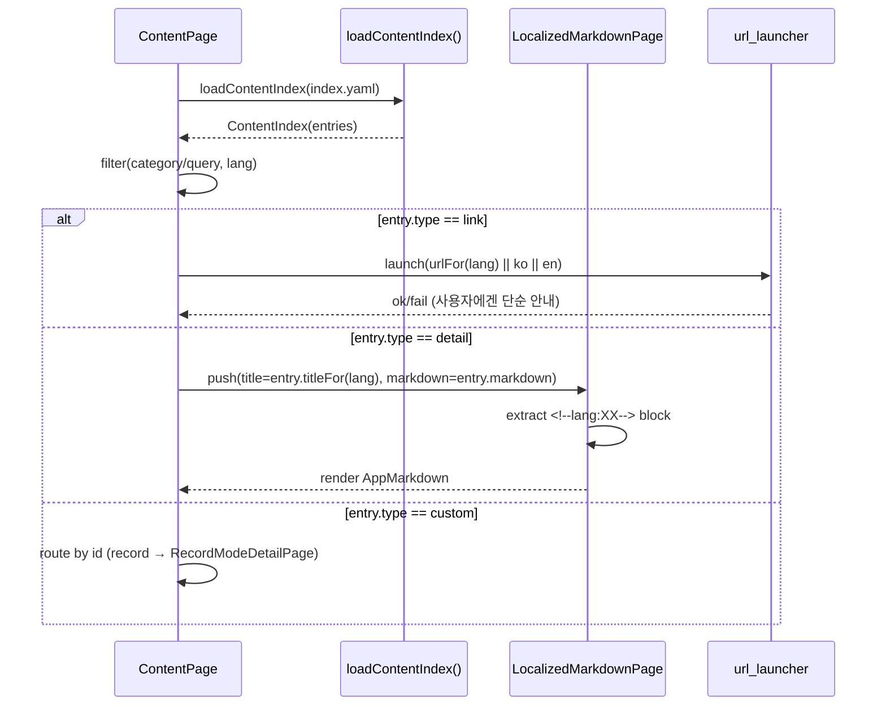

# Content — MDC

> AI/개발자가 `content` 기능을 구현/확장할 때 따르는 **단일 기준**입니다. (작성자는 비개발자 가정)

---

## 1) 모듈 맵

* `content_index.dart` — **모델/파서/로더**

    * `ContentEntry`(id/category/type/title/description/image/markdown/url)
    * `ContentIndex(entries)` / `loadContentIndex(assetPath)`
* `content_page.dart` — **목록/검색/오픈 오케스트레이션**

    * 필터(카테고리/쿼리), 카드 렌더, link/detail/custom 분기
* `localized_markdown_page.dart` — **상세 공용 뷰어**

    * `<!-- lang:ko --> ... <!-- /lang -->` 블록 추출·렌더
* (외부) `app_markdown.dart` — Markdown 렌더러
* (외부) `url_launcher`, `yaml`, `rootBundle` — 의존 라이브러리

---

## 2) 퍼블릭 계약 (요약)

```dart
// a) YAML → 모델 로딩
Future<ContentIndex> loadContentIndex({String assetPath = 'assets/content/index.yaml'});

// b) 인덱스 필터링 (언어 인지)
class ContentIndex {
  final List<ContentEntry> entries;
  List<ContentEntry> filter({ContentCategory? category, String? query, required String lang});
}

// c) 엔트리 언어 선택 헬퍼
extension ContentEntryI18n on ContentEntry {
  String titleFor(String lang);
  String descriptionFor(String lang);
  String? urlFor(String lang); // url: {'ko','en'} 또는 {'*': ...} 지원
}

// d) 상세 공용 뷰어
class LocalizedMarkdownPage extends StatefulWidget {
  const LocalizedMarkdownPage({
    required String title,
    required String markdownAsset,
    VoidCallback? onClose,
  });
}
```

---

## 3) 데이터 스키마

### `assets/content/index.yaml`

```yaml
- id: battle
  category: hyZone            # hyZone | info
  type: detail                # custom | detail | link
  title: { ko: 대결모드, en: Battle Mode }
  description:
    ko: 오헌영과 아이작 대결해 보세요
    en: Go head-to-head with Hy in Isaac.
  image: assets/content/thumb.png
  markdown: assets/content/detail.md

- id: info-isaacguru
  category: info
  type: link
  title: { ko: Isaac Guru Laboratory, en: Isaac Guru Laboratory }
  description:
    ko: 아이템 정보를 빠르게 찾아보세요
    en: Look up item info fast.
  image: assets/content/isaacguru.jpg
  url: https://isaacguru.com/

- id: record
  category: hyZone
  type: custom                 # 앱 제공 특수 페이지 라우팅(예: record → RecordModeDetailPage)
  title: { ko: 시참대회, en: Record Showdown }
  description:
    ko: 오헌영의 아이작 기록 경쟁
    en: Hy's Isaac record challenge.
  image: assets/content/record-thumb.png
```

#### 필드 정책

* `type=detail` → `markdown` **필수**
* `type=link` → `url` **필수** (문자열 또는 `{ko,en}` 맵, `{'*': ...}` 와일드카드 허용)
* `title/description`은 `{ko,en}` 중 **한 언어만** 있어도 동작(빈 언어는 fallback)

### `detail.md` (언어 블록)

```markdown
<!-- lang:ko -->
# 제목(한글)
본문...
<!-- /lang -->

<!-- lang:en -->
# Title (English)
Body...
<!-- /lang -->
```

> 언어 블록이 없으면 **파일 전체**를 렌더(작성 실수 안전망).

---

## 4) 시퀀스



---

## 5) i18n 선택 규칙

* 텍스트: `map[lang] ?? map['ko'] ?? map['en'] ?? firstValue`
* URL: `map[lang] ?? map['*'] ?? map['ko'] ?? map['en']`
* Markdown: 현재 `Locale.languageCode`에 해당 블록이 있으면 그만 렌더, 없으면 **전체 파일**

---

## 6) UX/에러/로딩 정책

* **로딩**: 목록은 `ProgressRing`(센터), 상세는 카드 레이아웃 유지 + `ProgressBar`
* **에러**: 사용자에겐 **단순 문구**만(“불러오지 못했어요. 잠시 후 다시 시도해 주세요.”), **에러 코드/스택 비노출**
* **레이아웃**: 로딩/에러 시에도 카드/그리드 **크기·간격 유지**
* **테마**: 고정색 금지, `AppTypography`/`AppSpacing`/`AppRadius`와 `FluentTheme.resources` 파생색만 사용
* **이미지 실패**: Fallback 아이콘/배경 표시(빈칸 금지)

---

## 7) 보안/정합/성능

* 외부 링크는 `LaunchMode.externalApplication`로만 오픈, 빈/잘못된 URL은 **즉시 경고 후 중단**
* 자산 접근은 `rootBundle`만 사용(로컬 파일 실행 금지)
* 인덱스 파싱 결과는 화면 생존 주기 동안 **캐시**, 언어 변경/리셋 시 필요한 부분만 재계산
* YAML 문법 오류는 **파서에서 예외** 발생 → UI는 사용자 친화 문구로 대체 표기

---

## 8) 테스트 케이스

* “`type=detail`에서 `markdown` 누락 시 예외를 던진다”
* “`type=link`에서 `url` 누락 시 예외를 던진다”
* “`imageAsset/url` 키 호환이 정상 동작한다”
* “`title/description` 언어 fallback 규칙을 따른다 (ko→en→first)”
* “`urlFor`가 `{'*': ...}` 와일드카드를 사용한다”
* “Markdown 언어 블록이 없으면 전체 렌더한다”
* “`type=custom(id=record)`는 RecordModeDetailPage로 라우팅된다”
* “목록 로딩 실패 시 사용자에겐 단순 안내, 내부 로깅만 수행된다”

---

## 9) 체크리스트

* [ ] `index.yaml`이 **리스트 최상위** 구조인지 확인
* [ ] 각 엔트리의 `id/type/category` 유효성 검사
* [ ] `detail`/`link` 필수 필드 존재 여부 검증
* [ ] 언어 선택 로직 및 URL 와일드카드 처리 테스트
* [ ] 로딩/에러 시 **레이아웃 유지** 및 **토스트 문구** 톤 확인
* [ ] 커스텀 라우팅 매핑(record 등) 최신화

---

## 10) 확장 포인트

* `type=custom` 매핑 테이블 확장: `Map<String, WidgetBuilder>`로 외부 선언
* 원격 컨텐츠(HTTP) 캐싱 레이어 추가 시에도 계약 유지: 파서는 동일 모델 반환
* 더 많은 언어 필요 시에도 ARB 없이 **파일 내 병행 집필** 방식 유지 가능

> 이 문서는 비개발자 컨텐츠 집필 가이드와 함께 읽히는 **개발 측 기준서**입니다.
