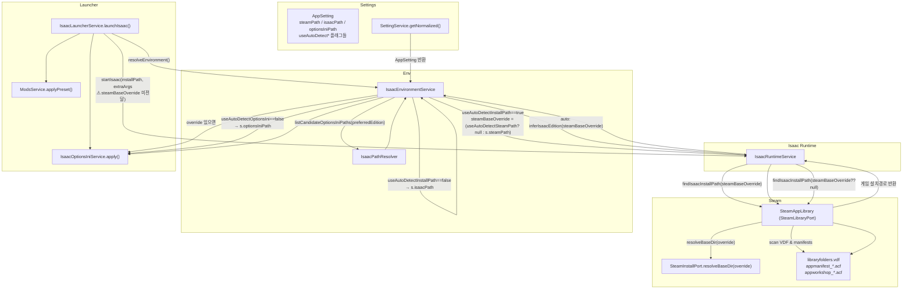

```mermaid
graph TD
subgraph Settings
AS[AppSetting<br/>steamPath / isaacPath / optionsIniPath<br/>useAutoDetect* 플래그들]
SS["SettingService.getNormalized()"]
end

subgraph Steam
SIP["SteamInstallPort.resolveBaseDir(override)"]
SAL["SteamAppLibrary (SteamLibraryPort)"]
VDF["libraryfolders.vdf<br/>appmanifest_*.acf<br/>appworkshop_*.acf"]
end

subgraph Isaac Runtime
IRS[IsaacRuntimeService]
end

subgraph Env
IES[IsaacEnvironmentService]
IPR[IsaacPathResolver]
end

subgraph Launcher
ILS["IsaacLauncherService.launchIsaac()"]
OIS["IsaacOptionsIniService.apply()"]
MS["ModsService.applyPreset()"]
end

SS -->|AppSetting 반환| IES

%% Install Path 결정
IES -->|useAutoDetectInstallPath==false<br/>→ s.isaacPath| IES
IES -->|"useAutoDetectInstallPath==true<br/>steamBaseOverride = (useAutoDetectSteamPath? null : s.steamPath)"| IRS

IRS -->|"findIsaacInstallPath(steamBaseOverride)"| SAL
SAL -->|"resolveBaseDir(override)"| SIP
SAL -->|scan VDF & manifests| VDF
SAL -->|게임 설치경로 반환| IRS --> IES

%% Options.ini 결정
IES -->|override 있으면| OIS
IES -->|useAutoDetectOptionsIni==false<br/>→ s.optionsIniPath| OIS
IES -->|"auto: inferIsaacEdition(steamBaseOverride)"| IRS
IRS --> SAL --> VDF
IES -->|"listCandidateOptionsIniPaths(preferredEdition)"| IPR --> IES --> OIS

%% Launch
ILS -->|"resolveEnvironment()"| IES
ILS --> OIS
ILS --> MS
ILS -->|"startIsaac(installPath, extraArgs<br/>⚠︎ steamBaseOverride 미전달)"| IRS
IRS -->|"findIsaacInstallPath(steamBaseOverride??null)"| SAL
```