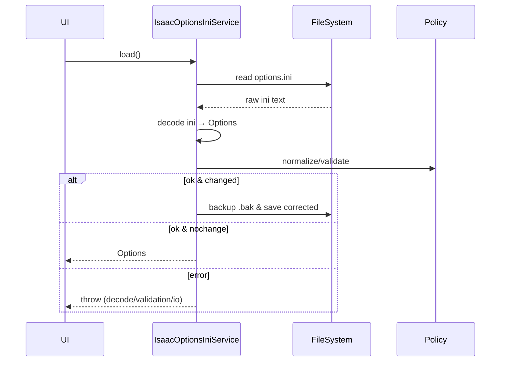

# Isaac Options — MDC

> AI/개발자가 `feature/isaac/options`를 구현/확장할 때 따르는 **단일 기준**입니다. (Windows 전용)

## 1) 모듈 맵
- `isaac_options.dart` — **Entity**: Freezed 옵션 모델(+JSON), 파생 헬퍼.
- `isaac_options_schema.dart` — **Schema**: 키/타입/기본값/범위·열거 정의.
- `isaac_options_decoder.dart` — **Decoder**: INI→도메인 변환(주석/중복/대소문자 허용).
- `isaac_options_policy.dart` — **Policy**: normalize()/validate()·상호 의존 규칙·오류 매핑.
- `isaac_options_ini_service.dart` — **Service**: 경로 탐지→로드→정책 적용→(선택)교정 저장.

---

## 2) 스키마 규격(스키마 파일에서 **전부** 정의, 예시 포함)
> 실제 키 목록/타입/기본값/범위는 **`isaac_options_schema.dart`가 단일 진실**입니다.

### 2.1 타입 시스템
- `Bool`(허용 표현: `1/0/true/false/True/False`), `Int(min..max)`, `Double(min..max)`, `Enum({values})`, `String(trim)`, `Path(win)`.

### 2.2 대표 키 예시(실제 프로젝트 스키마에 맞춰 유지)
| key            | type             | default | normalize        | validate               |
|----------------|------------------|:-------:|------------------|------------------------|
| `fullscreen`   | Bool             |  true   | bool 파싱(대소문자 무시) | —                      |
| `vsync`        | Bool             |  true   | bool 파싱          | —                      |
| `width`        | Int(640..7680)   |  1920   | 범위 클램프           | `height`와 쌍; 최소 종횡비 적용 |
| `height`       | Int(480..4320)   |  1080   | 범위 클램프           | `width`와 쌍; 최소 종횡비 적용  |
| `music_volume` | Int(0..100)      |   100   | 범위 클램프           | —                      |
| `sfx_volume`   | Int(0..100)      |   100   | 범위 클램프           | —                      |
| `language`     | Enum{`ko`,`en`}  |  `ko`   | lower-case       | 집합 밖이면 기본값으로 교정        |
| `controller`   | Bool             |  false  | bool 파싱          | —                      |
| `gamma`        | Double(0.5..2.5) |   1.0   | 소수점 파싱, 범위 클램프   | —                      |

> 표는 **예시 형식**입니다. 실제 항목은 `isaac_options_schema.dart`의 값과 반드시 일치해야 합니다.

---

## 3) 디코더(ini → 도메인) 규칙
- 인코딩: **UTF-8(BOM 허용)** 시도 → 실패 시 시스템 로캘 재시도; 주석 `;`, `#`, `//` 허용; 키 대소문자 무시; 중복 키는 **마지막 값 우선**; section 유무 모두 허용(기본은 섹션 없음).

---

## 4) 정책(normalize/validate) 규칙
- **정규화**: trim, bool/enum 엄격 변환, 숫자 **클램프**, 경로 정규화(백슬래시/확장자), 파생 일관성(예: width×height 최소값·종횡비).
- **검증**: 스키마 범위/열거 위반 → `validation_failed`(필드별 코드/메시지); 상호 의존 위반(예: 0 크기, 음수 볼륨)도 포함.
- **교정 우선**: 가능한 한 **교정 후 통과**를 목표로 하되, 치명적 위반은 예외로 승격.

---

## 5) 서비스 흐름


---

## 6) 계약(Interfaces)

### 6.1 서비스
```dart
abstract class IsaacOptionsService {
  Future<IsaacOptions> load();           // 읽기(+정책 적용, 필요 시 교정 저장)
  Future<void> save(IsaacOptions v);     // 안전 저장(백업 옵션)
  Future<IsaacOptions> update(IsaacOptions patch); // 부분 병합 후 검증+저장
}
```

### 6.2 정책
```dart
class IsaacOptionsPolicy {
  Either<PolicyError, IsaacOptions> normalizeAndValidate(IsaacOptions v);
}
```

### 6.3 디코더
```dart
class IsaacOptionsDecoder {
  IsaacOptions decode(String ini);
  String encode(IsaacOptions v, {bool preserveUnknown=true});
}
```

---

## 7) 에러 매핑
- 파일/경로: `file_not_found`, `permission_denied`, `io_error`
- 디코딩: `decode_error`(구문/인코딩)
- 정책: `validation_failed`(필드별 violations 포함)

---

## 8) 설정 연동
- `Settings`의 `optionsIniPath`/`useAutoDetectOptionsIni`를 존중하며, 자동탐지 ON이면 **표준 문서 폴더 경로** 우선 시도 후 사용자 지정 경로로 폴백.

---

## 9) 테스트 케이스
- “bool 다양한 표기 파싱”, “숫자 **경계 클램프**”, “enum 비정상 → 기본값 교정”, “round-trip(idempotent)”, “알 수 없는 키 **보존**”, “백업 생성 및 안전 저장”, “잘못된 INI는 decode_error”.

---

## 10) 체크리스트
- [ ] 스키마와 코드의 **동일성** 보장(스키마 변경 시 테스트 업데이트)
- [ ] 인코딩/주석/대소문자/중복 키 허용 로직 커버
- [ ] 상호 의존 규칙(해상도/볼륨 등) 테스트
- [ ] 저장 전 `.bak` 백업 옵션 확인
- [ ] 미지 키 **보존** 전략 유지(미래 호환)
