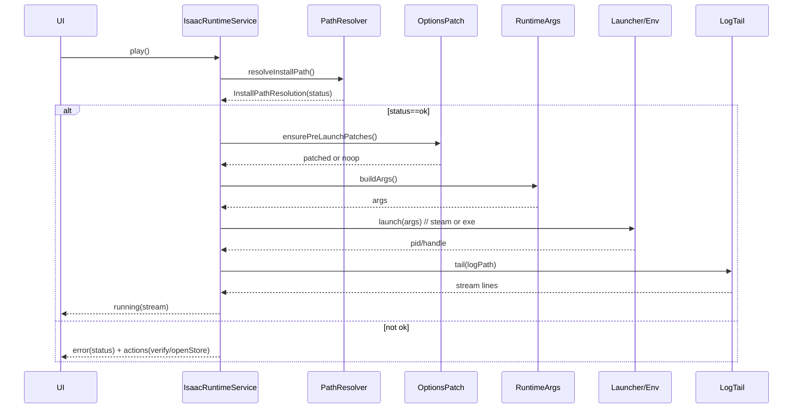

# Isaac Runtime — MDC

> AI/개발자가 `feature/isaac/runtime`을 구현/확장할 때 따르는 **단일 기준**입니다. (Windows 전용)

## 1) 모듈 맵
- `install_path_result.dart` — **InstallPathResolution/Status/Source** 정의.
- `isaac_path_resolver.dart` — **경로 판별 로직**(설정 값 + 자동탐지 + 검증).
- `isaac_runtime_service.dart` — **메인 유스케이스**(resolve→patch→args→launch→log).
- `runtime_args.dart` — **인자 구성기**(정책 기반 안전 인자).
- `isaac_options_patch.dart` — **options.ini 패치**(교정/백업/보수적 쓰기).
- `isaac_log_tail.dart` — **로그 tail**(끝 n줄 + 실시간 watch).
- `isaac_environment_service.dart` — **실행 환경**(already running, process handle, throttle hook).
- `isaac_steam_links.dart` — **Steam 헬퍼**(스토어/워크샵/무결성/속성).
- `isaac_steam_ids.dart`, `isaac_versions.dart`, `repentogon.dart` — **상수/에디션 판별**.

---

## 2) 설치 경로 해석 스키마 — `InstallPathResolution` 
| 필드        | 타입                  | 필수 | 설명                                                           |
|-----------|---------------------|:--:|--------------------------------------------------------------|
| `path`    | `String?`           | ⭕  | 최종 후보 경로(없을 수 있음).                                           |
| `status`  | `InstallPathStatus` | ✅  | `ok/dirNotFound/exeNotFound/autoDetectFailed/notConfigured`. |
| `source`  | `InstallPathSource` | ✅  | `manual`(설정) / `auto`(자동탐지).                                 |
| `isValid` | `bool`              | ✅  | `status == ok`.                                              |

**판별 규칙(권장)**
1) 설정의 `isaacPath`가 존재하면 **manual 우선** 검사 → 폴더/`isaac-ng.exe` 존재 확인
2) manual 실패 또는 미구성 → **auto**: Steam 라이브러리에서 appmanifest → `installdir`로 경로 도출
3) 최종 결과를 `InstallPathResolution`으로 반환

---

## 3) 런타임 서비스 플로우


---

## 4) 실행 인자 정책 — `runtime_args.dart` 
- **원칙**: 안전·호환 우선, 공백/한글 경로는 반드시 따옴표, 미지원 인자는 제거.
- **예시 필드**(프로젝트 정책 기준): `windowed`, `noIntro`, `debug`, `console`, `profileName` 등 → 존재하는 경우에만 추가.
- **출력**: `List<String>` 또는 `String`(ShellExecute용) — 두 경로 모두 따옴표 처리 보장.

---

## 5) 옵션 패치 — `isaac_options_patch.dart` 
- **정규화/교정**: 화면 모드/해상도/언어 등 최소 세트 교정.
- **보수적 쓰기**: 변경 있을 때만 저장, 저장 전 `.bak` 백업 권장.
- **Idempotent**: 같은 입력은 같은 출력(중복 쓰기 금지).

---

## 6) 로그 tail — `isaac_log_tail.dart` 
- **기능**: 마지막 n줄을 즉시 제공 + 파일 변경 감시로 실시간 라인 스트림.
- **에러 허용**: 파일 미존재/잠김은 재시도 또는 빈 스트림으로 처리(앱 크래시에도 안전).

---

## 7) Steam 헬퍼 — `isaac_steam_links.dart` 
- `openIsaacPage()`, `openIsaacWorkshopHub()`, `openIsaacWorkshopItem(id)`, `openIsaacProperties()`, `verifyIsaacIntegrity()`를 제공(실패 시 웹 폴백).

---

## 8) 환경 서비스 — `isaac_environment_service.dart` 
- **중복 실행 방지**(이미 실행 중 확인), **자원 최소화 모드** 훅 제공(게임 실행 동안 백그라운드 작업 중단/완화), **프로세스 종료 감지**.

---

## 9) 에러 매핑
| 영역      | 코드 예시                                                           | 처리 가이드                         |
|---------|-----------------------------------------------------------------|--------------------------------|
| 경로 해석   | `not_configured/dir_not_found/exe_not_found/auto_detect_failed` | UI에 상태별 가이드/버튼(무결성 검증, 스토어 열기) |
| 옵션 패치   | `options_read_error/options_write_error/validation_failed`      | 백업 후 롤백/재시도                    |
| 인자 구성   | `invalid_args`                                                  | 기본 인자만으로 재시도                   |
| 실행(런처)  | `steam_not_found/launch_failed/permission/timeout`              | 웹 폴백 또는 관리자 권한 안내              |
| 로그 tail | `log_not_found/io_busy`                                         | 지연 재시도/빈 스트림 허용                |

---

## 10) 보안/UX/성능
- **사용자 트리거**에서만 실행, 경로/인자 **정규화**, 관리자 권한 요구 금지.
- 실행 중 **자원 최소화 모드** 적용(워처/타이머 완화), 종료 시 원복.
- 파일 I/O/대용량 스캔은 **Isolate**로 이전하여 UI 프리즈 방지.

---

## 11) 프로바이더/DI(예시)
```dart
final isaacRuntimeServiceProvider = Provider<IsaacRuntimeService>((ref) => ...);
final isaacPathResolverProvider   = Provider<IsaacPathResolver>((ref) => ...);
final isaacEnvServiceProvider     = Provider<IsaacEnvironmentService>((ref) => ...);
```

---

## 12) 테스트 케이스
- “설정 경로 유효 → status=ok, source=manual, isValid=true”
- “설정 미구성 → auto 탐지 실패 → status=autoDetectFailed”
- “폴더 있음+exe 없음 → status=exeNotFound”
- “옵션 패치가 **변경 없으면 저장하지 않는다**(idempotent)”
- “인자 빌더가 공백/한글 경로를 **안전하게 인용**한다”
- “steam 런치 실패 시 **웹 폴백**한다”
- “로그 tail이 마지막 n줄 제공 후 실시간으로 이어진다”
- “이미 실행 중이면 **중복 실행을 방지**한다”

---

## 13) 체크리스트
- [ ] exe 파일명/경로 감지에서 대소문자/심볼릭 링크 고려
- [ ] ShellExecute 호출 인용 규칙 이중 확인(공백/한글)
- [ ] 옵션 백업 `.bak` 생성 및 오류 시 롤백
- [ ] 자원 최소화 모드 진입/복귀 훅 연결
- [ ] 모든 외부 의존(steam/파일시스템/프로세스)을 **모킹**하여 테스트
