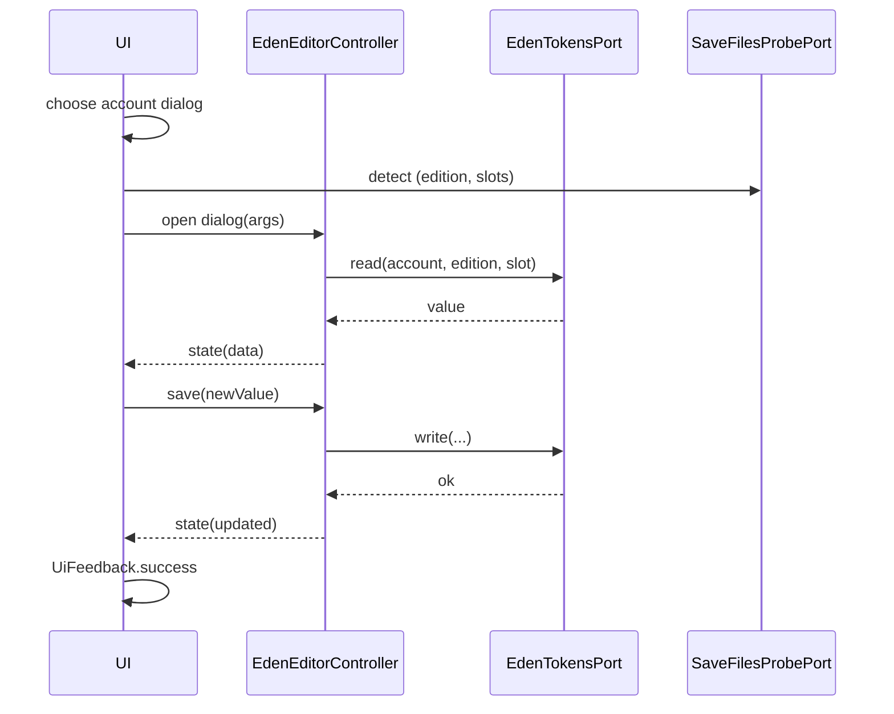

# Isaac Save — MDC v2

> `feature/isaac/save` 구현/확장 시 따르는 단일 기준. (Windows 전용)

## 1) 모듈 맵 (현재 구조)
```

save/
├─ application/
│  ├─ eden\_editor\_controller.dart      # Riverpod AsyncNotifier(패밀리) 상태/동작
│  └─ isaac\_save\_service.dart          # 서비스 파사드(포트 호출 + 로깅/에러 전파)
├─ domain/
│  └─ ports/
│     ├─ eden\_tokens\_port.dart         # Eden 토큰 read/write 포트
│     └─ save\_files\_probe\_port.dart    # 에디션/슬롯 감지 포트(프로브)
├─ infra/
│  ├─ isaac\_eden\_file\_adapter.dart     # EdenTokensPort 파일 어댑터
│  ├─ isaac\_save\_codec.dart            # 이진 코덱(섹션 테이블/체크섬 포함)
│  ├─ isaac\_save\_file\_namer.dart       # 파일 네이머(슬롯↔파일명 규칙)
│  └─ save\_files\_probe\_fs\_adapter.dart # 파일시스템 기반 슬롯 스캐너
└─ presentation/
└─ widgets/
├─ show\_choose\_steam\_account\_dialog.dart  # 계정 선택 다이얼로그
└─ show\_eden\_editor\_dialog.dart           # 에덴 토큰 에디터 다이얼로그

````

## 2) 서비스 계약 (파사드)
```dart
class IsaacSaveService {
  IsaacSaveService({required SteamUsersPort users});
  Future<List<SteamAccountProfile>> findSaveCandidates();
}
````

* 동작: 시작/완료 로그 → `SteamUsersPort.findAccountsWithIsaacSaves()` → 결과 반환.
* 에러: 포트 예외는 **rethrow**.
* 로깅 키: `IsaacSaveService`, `op=findCandidates fn=findSaveCandidates msg=start|done|failed count=<n>`.

## 3) 포트 계약

### 3.1 EdenTokensPort

```dart
abstract class EdenTokensPort {
  Future<int> read(SteamAccountProfile acc, IsaacEdition e, int slot);
  Future<void> write(SteamAccountProfile acc, IsaacEdition e, int slot, int value, {
    bool makeBackup = true, SaveWriteMode mode = SaveWriteMode.atomicRename,
  });
}
```

* 파일 I/O, 백업 정책, 원자적 저장 모드 제공.

### 3.2 SaveFilesProbePort

* 역할: 에디션 자동 판별 + 존재하는 슬롯 목록 반환.
* 구현은 FS 스캔(`...\userdata/<account>/250900/remote`) 등.

## 4) 코덱(isaac\_save\_codec.dart)

* **엔디안:** little-endian.
* **Eden Tokens 오프셋:** `section[1] + 0x04 + 0x50` (UInt32 LE).
* **체크섬(AB/AB+/Rep/Rep+)**: Afterbirth-family CRC 테이블 기반. `updateChecksumAfterbirthFamily()`로 마지막 4바이트 갱신.
* **Rebirth**는 포맷/체크섬이 다르므로 **같은 방식 적용 금지**.

## 5) 에디터 UI 플로우

1. `openEdenTokenEditor(context, ref)`

    * `steamAccountsProvider.future` 로 계정 조회 → (0개) 경고 → (여러 개) `showChooseSteamAccountDialog()`.
2. `editionAndSlotsProvider` 로 (edition, slots) 획득.
3. `EdenEditorArgs` 생성 후 `showDialog(_EdenEditorDialog)` 오픈.
4. 다이얼로그 내부에서 `edenEditorControllerProvider(args)` 구독.

    * 첫 빌드에 포트 `read()` 호출 → `EdenEditorState` 세팅
    * 슬롯 변경 `selectSlot()`로 재조회
    * 저장 시 `write()` → 재조회 → 성공 시 `UiFeedback.success()`.

## 6) 에러/UX 규약

* 목록 없음/에러: `UiFeedback.warn/error`로 즉시 피드백.
* Rebirth 에디션: 저장 버튼 비활성화 안내.
* 다이얼로그는 `useRootNavigator: false`로 현재 네비게이터/오버레이 기준 표시.

## 7) 테스트 지침 (global-rule 준수)

### 7.1 단위(Unit)

* `IsaacSaveService`:

    * 포트가 0/2개 반환 → 동일 개수 반환
    * 포트 예외 → **rethrow**
    * 시작/완료 로그 포맷 확인(스파이/프록시 로거)
* `IsaacSaveCodec`:

    * 섹션 테이블 걷어 Eden 값 **읽기/쓰기** round-trip
    * Afterbirth-family **체크섬 갱신** 일치
    * 버퍼 범위·엔디안 처리

### 7.2 위젯/통합(Widget/Integration)

* **Fluent scaffolding**: `FluentApp + NavigationView + ScaffoldPage`(+ Localizations).
* `show_choose_steam_account_dialog`

    * 오픈 시 제목/항목 표출
    * 취소 시 `null` 반환 및 라벨 유지
    * 항목 탭 시 라벨 갱신
* **Eden 에디터 플로우**

    * Open → 슬롯/값 UI 노출
    * 저장 버튼 동작 → 포트 `write()` 호출 검증(또는 state 변경 확인)
    * Rebirth: 버튼 disabled

### 7.3 골든(Golden)

* 폰트 로딩(한글): 테스트 전 `loadTestFonts()` 또는 프로젝트 폰트(`Pretendard`) 로드.
* `screenMatchesGolden('eden_dialog_initial')` 등 스냅샷 유지.
* OS 차이 줄이기: 텍스트/섀도우 변수를 줄이고 동일 폰트 사용.

## 8) 알려진 함정

* `FluentLocalizations` 누락 → `FluentApp`에 delegate/supportedLocales 명시.
* `Overlay` 누락 → `NavigationView`/`ScaffoldPage` 하에 다이얼로그·InfoBar가 올라갈 수 있게 구성.
* `displayInfoBar` 자동 close 타이머 → 테스트에선 `pump(Duration)`로 소멸까지 진행하거나 close 버튼 탭.

## 9) 커버리지 목표

* 코덱/서비스/핵심 위젯 최소 라인 커버리지 80%+ 권장.
* 외부 I/O는 포트 모킹으로 격리.

## 10) 시퀀스(요약)


