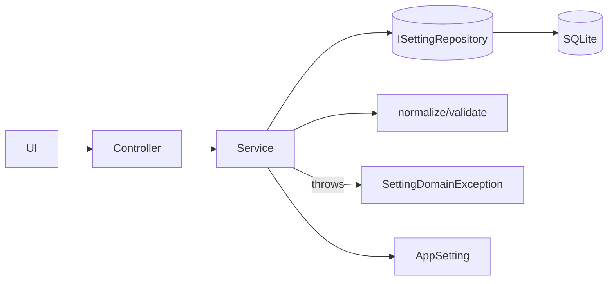

# Settings Module — MDC

> 이 문서는 `setting` 관련 기능을 구현할 때 따라야 할 **단일 출처 표준**입니다.
> Clean Architecture + BLoC + GetIt + GoRouter 기반, **Windows 전용** 전제.

## 1) 모듈 맵

* `app_setting.dart` — **불변 도메인 모델**과 기본값/정규화 보조자(Freezed/JSON).
* `setting_policy.dart` — **정규화/검증 규칙**: 트리밍·소문자화·범위/필수성 체크.
* `setting_domain_exception.dart` — **정책 위반/도메인 오류**를 구조화한 예외 타입.
* `i_setting_repository.dart` — **추상 저장소 계약**: `load()/save()`를 표준화.
* `sqlite_setting_repository.dart` — **SQLite 구현체**: 단일 행 테이블에 직렬화 영속.
* `setting_service.dart` — **유스케이스 파사드**: `getSettingView/getNormalized/update`.
* `app_setting_controller.dart` — **AsyncNotifier 컨트롤러**: 초기 로드/패치/오류 관리.
* `app_database.dart` — **Drift/SQLite 스키마**: `app_setting(id=1)` 단일톤 테이블.

---

## 2) 도메인 모델(AppSetting)

#### 필드/기본값/검증

```text
isaacPath                : String   | ""        | autoDetectInstallPath=false면 필수(존재 경로)
optionsIniPath           : String   | ""        | autoDetectOptionsIni=false면 필수(존재 경로)
rerunDelay               : int      | 1000      | 0..10000(ms)로 클램프
languageCode             : String   | "ko"      | one of {"ko","en"}
themeName                : String   | "system"  | 예: {"system","light","dark"} (프로젝트 정책)
useAutoDetectInstallPath : bool     | true      | true면 isaacPath 검증 건너뜀
useAutoDetectOptionsIni  : bool     | true      | true면 optionsIniPath 검증 건너뜀
```

#### 불변/직렬화

* Freezed 데이터 클래스(+ `fromJson/toJson`)로 **불변·값 동등성** 보장.
* `effectiveRerunDelay` 등 **파생 속성**은 범위 내 계산값을 반환.

---

## 3) 정책(정규화·검증)

```text
정규화(normalize)
- 문자열 필드: trim, 내부 다중 공백 단일화
- languageCode/themeName: lower-case
- 경로: trim, 끝 공백 제거 (Windows 경로는 케이스 보존)
- rerunDelay: 0..10000 범위로 클램프

검증(validate)
- autoDetect*가 false인 경우:
  - isaacPath / optionsIniPath 는 빈 문자열 금지 + 실제 파일/디렉터리 존재
- languageCode ∈ {ko,en}
- rerunDelay ∈ [0,10000]
- 실패 시 ValidationResult(필드별 code/message) 집계
```

---

## 4) 예외(SettingDomainException)

```text
구조: { code: String, message: String, violations?: List<Violation> }
권장 code:
- "validation_failed"  : 정책 위반(violations 동봉)
- "not_found"          : 저장소에 레코드 없음
- "persistence_error"  : DB/IO 오류
- "serialization_error": Json/Codec 오류
```

---

## 5) 저장소(Repository)

```dart
abstract class ISettingRepository {
  Future<AppSetting?> load();               // 없으면 null
  Future<void> save(AppSetting setting);    // 단일 행 upsert
}
```

* **구현체**: `SqliteSettingRepository`

  * 테이블: `app_setting` (단일톤: `id=1`)
  * 저장 시 **트랜잭션**으로 원자성 보장
  * JSON과 SQLite 혼용 시: 구조적 데이터(SQLite), 캐시/가벼운 스냅샷(JSON)

#### 스키마(app\_database.dart)

```sql
CREATE TABLE app_setting (
  id INTEGER PRIMARY KEY CHECK (id = 1),
  isaac_path TEXT NOT NULL DEFAULT '',
  options_ini_path TEXT NOT NULL DEFAULT '',
  rerun_delay INTEGER NOT NULL DEFAULT 1000,
  language_code TEXT NOT NULL DEFAULT 'ko',
  theme_name TEXT NOT NULL DEFAULT 'system',
  use_auto_detect_install_path INTEGER NOT NULL DEFAULT 1,
  use_auto_detect_options_ini INTEGER NOT NULL DEFAULT 1
);
```

---

## 6) 서비스(Use Cases 파사드)

```dart
/// 설정을 로드 → 정규화/검증 → 필요 시 교정 저장 후 값 반환
Future<Result<AppSetting>> getSettingView();

/// 원본 로드 → 정규화·검증 → 변경 있으면 저장 후 정규화본 반환
Future<AppSetting> getNormalized();

/// 부분 변경 병합 → 정규화·검증 → 저장 → 최신값 반환(noop 감지)
Future<Result<AppSetting>> update({ ...partial fields... });
```

**흐름 요약**

1. 저장소에서 읽기 → null이면 **defaults** 생성
2. `normalize()` → `validate()`
3. 위반 있으면 `SettingDomainException(validation_failed)`
4. 정상일 때만 저장소 반영(변화 없으면 **noop**)

---

## 7) 컨트롤러(AppSettingController)

```text
역할: 초기 비동기 로드, 상태 유지, 부분 업데이트(patch), 에러 표준화
- Provider:
  - appSettingControllerProvider (AsyncValue<AppSetting>)
  - appSettingValueProvider     (AppSetting만 노출)
동작: init → getSettingView() → state = data / error
패치: patch(partial) → service.update() → state 갱신
```

---

## 8) Windows 전용 고려사항

```text
- 경로 검증: 백슬래시/드라이브 문자를 허용, 존재성 체크는 sync/async 파일 API로 분기
- 기본 저장 위치: %AppData%/<Company>/<App>/app.db
- 관리자 권한 불필요(경로 읽기 실패 시 사용자 가이드 노출)
```

---

## 9) 시퀀스(간단)



---

## 10) TDD 테스트(테스트명: 한글, AAA)

```text
- "초기 로드: 레코드가 없으면 기본값으로 생성한다"
- "정규화: languageCode 대문자는 소문자로 저장된다"
- "검증 실패: autoDetect 해제 + 경로 없음이면 예외를 던진다"
- "rerunDelay가 범위를 벗어나면 0..10000으로 클램프된다"
- "업데이트: 변화 없으면 저장소 호출은 발생하지 않는다(noop)"
- "SQLite 저장/로드: 단일 행(id=1)만 유지된다"
- "컨트롤러: patch 성공 시 최신 AppSetting으로 상태가 갱신된다"
- "서비스: serialization 오류 시 SettingDomainException으로 매핑된다"
```

---

## 11) 에러 매핑 규칙

```text
저장소(DB/IO) → persistence_error
JSON 직렬화    → serialization_error
정책 위반      → validation_failed (violations[] 포함)
데이터 없음    → not_found (서비스 내부에선 defaults로 대체)
```

---

## 12) 변경 가이드(확장/리팩토링)

```text
- 새 필드 추가: defaults → normalize → validate → SQLite 컬럼/마이그레이션 → JSON 스냅샷 키
- 검증 강화: 정책은 setting_policy.dart에만 추가(단일 진실원칙)
- 저장 매체 추가(JSON 등): ISettingRepository 구현체 신규 추가, 서비스/컨트롤러는 무변경
```

---

## 13) 빠른 체크리스트

```text
[ ] Freezed 모델/JSON 동기화(app_setting.freezed.dart, .g.dart)
[ ] normalize/validate 정책 최신화(setting_policy.dart)
[ ] ISettingRepository 계약 준수 + 단일 행(id=1) 보장
[ ] 서비스 3종(getSettingView/getNormalized/update) 시그니처 유지
[ ] 컨트롤러 patch 경로에 정책 위반 예외 처리
[ ] TDD: 위 테스트 케이스 전부 통과(CI 적용)
```

---

## 14) 부록 — 예시 시그니처

```dart
typedef Result<T> = Either<SettingDomainException, T>;

class SettingService {
  Future<Result<AppSetting>> getSettingView();
  Future<AppSetting> getNormalized();
  Future<Result<AppSetting>> update({
    String? isaacPath,
    String? optionsIniPath,
    int?    rerunDelay,
    String? languageCode,
    String? themeName,
    bool?   useAutoDetectInstallPath,
    bool?   useAutoDetectOptionsIni,
  });
}
```