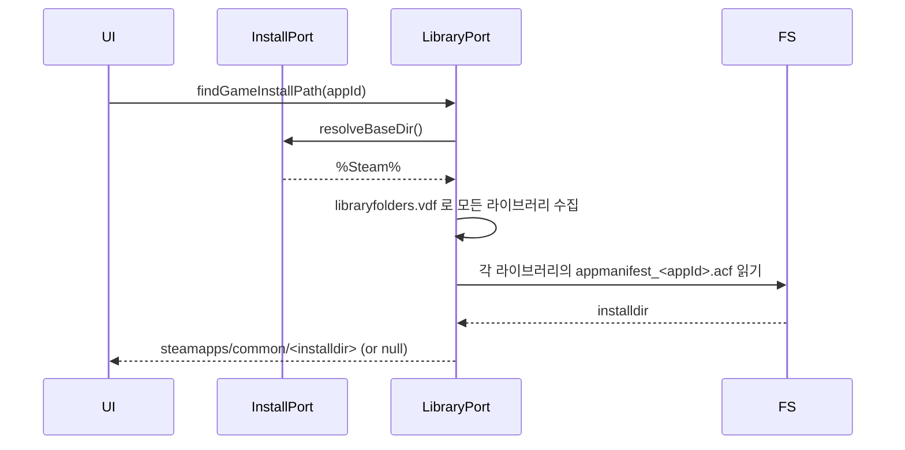
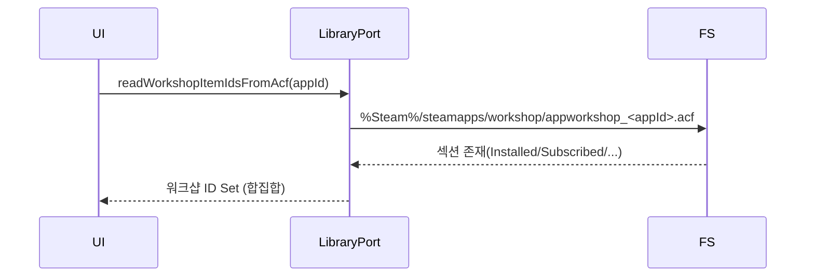

# Steam — MDC

> AI/개발자가 Steam 기능을 구현/확장할 때 따르는 **단일 기준**입니다. (Windows 전용 우선)

## 1) 모듈 맵
- `domain/models/steam_account_profile.dart` — **계정 프로필 엔티티**: `accountId(32-bit)`, `steamId64(17자리)`, `personaName`, `avatarPngPath(존재 파일만)`, `savePath`, `mostRecent`.
- `domain/steam_install_port.dart` — **설치 경로 포트**: `autoDetectBaseDir()`, `resolveBaseDir(override)`.
- `infra/windows/steam_install_locator.dart` — **설치 경로 구현(Windows)**: 레지스트리/HDD 후보 스캔, `steam.exe` 유효성 검사. (의존: `infra/windows/registry_reader.dart`, `infra/windows/fs_probe.dart`)
- `domain/steam_library_port.dart` — **라이브러리 포트(확장)**  
  - `findGameInstallPath(appId)`  
  - `readInstalledDepots(appId)`  
  - `readWorkshopItemIdsFromAcf(appId)`  
  - `listWorkshopContentItemIds(appId)`
- `infra/windows/steam_app_library.dart` — **라이브러리 구현**: `appmanifest_<id>.acf`, `libraryfolders.vdf`, `appworkshop_<id>.acf` 파싱 + `workshop/content/<appId>` 디렉터리 스캔.
- `infra/parsing/acf_utils.dart` — **ACF 파서 유틸**: 블록 추출/숫자 키 집합 추출.
- `domain/steam_users_port.dart` — **유저 포트**: Isaac(250900) 세이브 보유 계정 조회 `findAccountsWithIsaacSaves()`.
- `infra/users/steam_users_vdf_repository.dart` — **유저 구현**: `%Steam%\config\loginusers.vdf` 파싱 + `%Steam%\userdata\<accountId>\250900\remote` 존재 계정만 반환.
- `domain/steam_app_urls.dart` — **URL/URI 상수**: 스토어/워크샵/steam 프로토콜.
- `domain/steam_link_builder.dart` — **링크 빌더**: 스팀 도메인이면 `steam://openurl/<web>`로 감싸기.
- `domain/steam_links_port.dart` — **링크 포트**: 링크/프로토콜 실행 Interface.
- `infra/links/steam_url_launcher_adapter.dart` — **런처 어댑터**: `url_launcher`로 `steam://` 또는 `http/https`를 **외부 앱**으로 실행.
- `application/steam_links_service.dart` — **서비스**: 빌더+런처 오케스트레이션(정상 흐름 로그 없음, 실패만 로그).

---

## 2) 도메인 엔티티 — `SteamAccountProfile`
| 필드              | 타입      | 필수 | 설명                                                     |
|-----------------|---------|:--:|--------------------------------------------------------|
| `accountId`     | int     | ✅  | `...\userdata\<accountId>\` 폴더명(32-bit **AccountID**). |
| `steamId64`     | String  | ✅  | 17자리 SteamID64(문자열 보관; 정밀도 손실 방지).                     |
| `personaName`   | String? | ⭕  | 표시 이름(없을 수 있음).                                        |
| `avatarPngPath` | String? | ⭕  | **실존 파일**일 때만 세팅(없거나 손상 시 null).                       |
| `savePath`      | String  | ✅  | 예: `...\userdata\<accountId>\250900\remote`.           |
| `mostRecent`    | bool    | ✅  | 최근 로그인 사용자 여부.                                         |

> `steamId64 ↔ accountId` 계산보다 **폴더명(accountId) + 세이브 경로** 교차 검증을 우선.

---

## 3) VDF/ACF 파싱 스키마

### 3.1 `loginusers.vdf` → 프로필 매핑
- 루트 `"users" { "<steamId64>" { ... } }`
- `PersonaName` → `personaName`
- `MostRecent` == `"1"` → `mostRecent=true`
- `accountId` 매칭: `%Steam%\userdata\<accountId>\` 폴더 + `\250900\remote` 존재 검사
- 아바타: `%Steam%\config\avatarcache\<steamId64>.png` 존재 시만 경로 세팅
- 부재/파싱 실패는 **빈 맵 허용**(오류 아님, 로그 1건)

### 3.2 `appmanifest_<appId>.acf` → 설치 경로/Depot
- `"installdir"` → `<lib>\steamapps\common\<installdir>`
- `"InstalledDepots" { "<depotId>" { ... } }` → `Set<int>`로 반환
- 다중 라이브러리: `libraryfolders.vdf`(v1/v2)에서 보조 라이브러리 루트 수집 후 모두 스캔

### 3.3 `appworkshop_<appId>.acf` / `workshop/content/<appId>`
- ACF 섹션 우선순위: `WorkshopItemsInstalled` → `SubscribedItems` → `WorkshopItems` → `InstalledItems` (존재 시 합집합)
- 디렉터리 스캔: `workshop/content/<appId>/<workshopId>`(숫자 폴더명만) → 실제 설치된 **스팀 모드** ID 집합
- 로컬 수동 모드는 content 폴더에 없으므로 제외

---

## 4) 포트 Interface

### 4.1 `SteamInstallPort`
```dart
Future<String?> autoDetectBaseDir();
Future<String?> resolveBaseDir({String? override});
````

### 4.2 `SteamLibraryPort` (확장)

```dart
Future<String?> findGameInstallPath(int appId, {String? steamBaseOverride});
Future<Set<int>> readInstalledDepots(int appId, {String? steamBaseOverride});
Future<Set<int>> readWorkshopItemIdsFromAcf(int appId, {String? steamBaseOverride});
Future<Set<int>> listWorkshopContentItemIds(int appId, {String? steamBaseOverride});
```

### 4.3 `SteamUsersPort`

```dart
Future<List<SteamAccountProfile>> findAccountsWithIsaacSaves();
```

### 4.4 링크

* `SteamUrls.appPage(appId)` → `https://store.steampowered.com/app/<appId>/`
* `SteamUris.appPage(appId)` → `steam://url/StoreAppPage/<appId>` **(정정됨: DLC가 아니라 App 페이지)**
* `SteamLinkBuilder.preferSteamClientIfPossible(webUrl)`

    * 스팀 화이트리스트 도메인(`steamcommunity.com`, `store.steampowered.com`, `help.steampowered.com`)이면 `steam://openurl/<web>` 반환, 아니면 원본 유지

---

## 5) 실행 정책(보안/UX)

* 실행은 **사용자 트리거**에서만 수행
* 런처는 \*\*url\_launcher(외부 앱 모드)\*\*만 사용
* 정상 흐름은 **로그 X**, 실패 시 **한 줄 에러 로그**(`logE(tag, ...)`)
* Steam 미설치/프로토콜 미지원 시: 웹 URL로 여는 경로도 준비(링크 서비스에서 처리)

---

## 6) 시퀀스 다이어그램(발췌)

### 6.1 설치 경로 조회



### 6.2 워크샵 파싱



---

## 7) 테스트 가이드(보유 & 추가)

* Unit

    * `steam_link_builder_test.dart`: 화이트리스트 도메인은 `steam://openurl`로 래핑, 그 외 원본 유지, 잘못된 URL 입력도 원본 유지
    * `steam_urls_uris_test.dart`: URL/URI 포맷(특히 `StoreAppPage`)
    * `steam_links_service_test.dart`: 변환 확인 및 포트 예외 처리 시 throw 하지 않음(테스트 더블은 @immutable 준수)
    * `steam_app_library_parse_test.dart`: ACF 블록/숫자 키 파서 유닛
* Integration

    * `steam_install_auto_detect_it_test.dart`: 설치 경로 자동 탐지
    * `steam_install_locator_test.dart`: 레지스트리/후보 경로 유효성
    * `steam_app_library_it_test.dart`: appmanifest 설치 경로/depots 파싱
    * `steam_app_library_libraryfolders_v2_it_test.dart`: v2(path) 보조 라이브러리 지원
    * `steam_app_library_workshop_variants_it_test.dart`: ACF 섹션 변형 대응, content 디렉터리 스캔
    * `steam_users_vdf_repository_it_test.dart`: loginusers.vdf + 세이브 폴더 교차 검증

> Windows 외 환경에서는 경로/레지스트리 특성상 **skip** 처리 권장.

---

## 8) 로깅 원칙(최소)

* InstallLocator: override 채택/무효, 자동탐지 성공 소스(hkcu/wow6432/hklm/candidate), 실패(1건)
* UsersVdfRepository: start/base, `userdata` 없음, 최종 계정 수, 파싱 실패만
* Library: 경로 발견 또는 미발견, depots/워크샵 ID 개수 요약, 파싱 실패만

---

## 9) 체크리스트

* [ ] `SteamUris.appPage()`가 **StoreAppPage**로 설정되었는가
* [ ] `acf_utils.dart`가 **단일 파일**로만 존재하는가(중복 정의 제거)
* [ ] `SteamShellAdapter` 코드/참조가 **모두 삭제**되었는가
* [ ] `steam_link_builder.dart` import가 **패키지 경로**로 고정되었는가
* [ ] 워크샵: ACF(정확) + content(설치 상태) **두 축**을 모두 지원하는가
