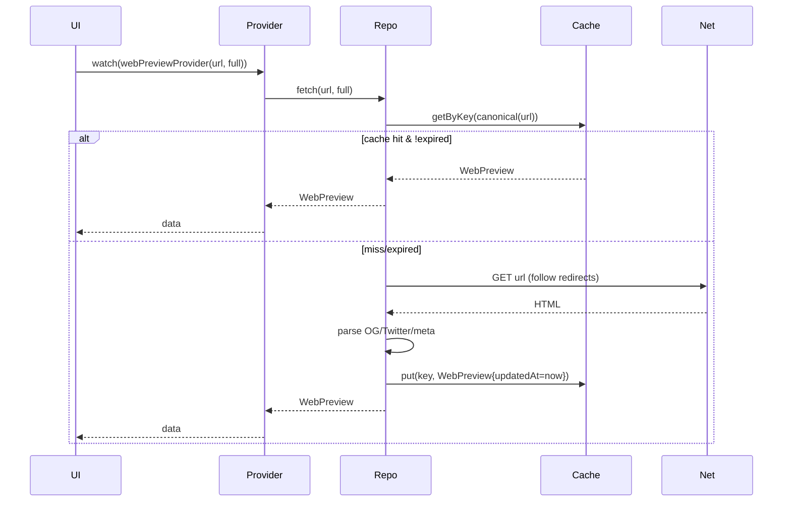
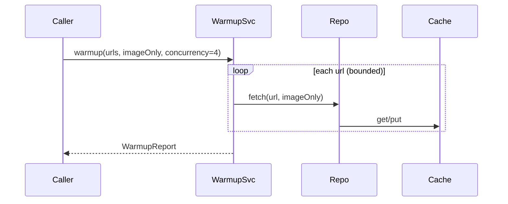

# Web Preview — MDC

> AI/개발자가 `web_preview` 기능을 구현/확장할 때 **반드시** 참조할 표준 문서입니다.  
> Clean Architecture + Riverpod 기준. 테스트 우선(TDD) 권장.

## 1) 모듈 맵
- `web_preview.dart` — **Entity**: `WebPreview` + 도메인 유틸(절대경로 변환/제목 클린업).
- `web_preview_cache.dart` — **Cache**: 키 정규화, TTL/LRU, invalidate API.
- `web_preview_repository.dart` — **Repository**: fetch+parse → cache 일원화, `PreviewMode` 지원.
- `web_preview_providers.dart` — **Providers**: `webPreviewProvider.family`, repo/cache DI.
- `preview_warmup_service.dart` — **Warmup**: URL 리스트 프리페치(동시성/타임아웃 제어).
- `preview_warmup_controller.dart` — **Controller**: 진행률/에러/재시도 orchestration.

## 2) 도메인 모델 (`WebPreview`)
````text
fields:
- url: Uri                  // 기준 URL(정규화 전 원본)
- finalUrl: Uri?            // 리디렉트 최종 URL(캐시 키)
- title: String?            // og:title → twitter:title → <title>
- description: String?      // og:description → twitter:description → meta[name=description]
- imageUrl: Uri?            // og:image 우선
- siteName: String?         // og:site_name → 도메인
- favicon: Uri?             // /favicon.ico 또는 <link rel="icon"> 탐색
- updatedAt: DateTime       // 캐시 갱신 시각
`````

## 3) 정책

### 3.1 URL 정규화(Key Canonicalization)

```text
- scheme/host: lower-case
- default ports 제거(80/443)
- 제거 쿼리: utm_*, fbclid, gclid, ref, ref_src 등 추적 파라미터
- fragment(#...) 제거
- 리디렉트 발생 시 최종 URL을 캐시 키로 사용
```

### 3.2 파싱 우선순위

```text
og:title > twitter:title > <title>
og:description > twitter:description > meta[name=description]
og:image[*] 첫 번째 유효 URL(상대경로는 절대변환)
siteName: og:site_name 없으면 PSL 기준 eTLD+1
favicon: <link rel=icon> → /favicon.ico
```

### 3.3 모드

```text
PreviewMode.full       : title/description/image/favicon 전부 파싱
PreviewMode.imageOnly  : 이미지 추출만(뉴스 최적화, HTTP 비용↓)
PreviewMode.headerOnly : title/description만(텍스트 미리보기)
```

### 3.4 캐시

```text
- TTL: 기본 7일(환경에 따라 상수/설정으로 치환)
- LRU: 메모리 상한 초과 시 최근 미사용부터 제거
- Persist(선택): 필요 시 디스크 보조 저장(옵션)
- invalidate(url)/invalidateAll() 제공
```

### 3.5 에러 분류/재시도

```text
- network_error / timeout / parse_error / unsupported_scheme / policy_reject / cache_miss
- 재시도 지수백오프(예: 0.5s, 1s, 2s), imageOnly 모드에선 1회만 시도(속도 우선)
```

## 4) 계약(Interfaces)

### 4.1 Repository

```dart
enum PreviewMode { full, imageOnly, headerOnly }

abstract class WebPreviewRepository {
  Future<WebPreview> fetch(Uri url, {PreviewMode mode = PreviewMode.full});
  Future<void> invalidate(Uri url);
  Future<void> invalidateAll();
}
```

### 4.2 Cache

```dart
abstract class WebPreviewCache {
  Future<WebPreview?> getByKey(String key);
  Future<void> put(String key, WebPreview value);
  Future<void> invalidate(String key);
  Future<void> invalidateAll();
  bool isExpired(WebPreview value); // TTL 판정
}
```

## 5) Providers(권장 네이밍)

```dart
final webPreviewCacheProvider = Provider<WebPreviewCache>((ref) => ...);
final webPreviewRepositoryProvider = Provider<WebPreviewRepository>((ref) => ...);

final webPreviewProvider = FutureProvider.autoDispose.family<WebPreview, ({Uri url, PreviewMode mode})>((ref, args) async {
  final repo = ref.watch(webPreviewRepositoryProvider);
  return repo.fetch(args.url, mode: args.mode);
});

final previewWarmupServiceProvider = Provider<PreviewWarmupService>((ref) => ...);
final previewWarmupControllerProvider = NotifierProvider<PreviewWarmupController, WarmupState>(PreviewWarmupController.new);
```

## 6) 워밍업(PreviewWarmupService)

```text
- 입력: List<Uri>, mode(기본 imageOnly), 동시성 N(기본 4), per-request timeout(기본 5s)
- 동작: 세마포어로 동시성 제한 → repo.fetch() → 성공/실패 집계
- 출력: WarmupReport{requested, succeeded, failed, duration}
- 정책: 성공/실패 모두 캐시에 흔적 남김(단, 실패는 TTL을 짧게)
```

## 7) 시퀀스

### 7.1 fetch (full)



### 7.2 warmup (imageOnly)



## 8) TDD 테스트(케이스명)

```text
- "URL 정규화: utm 파라미터 제거로 동일 키가 생성된다"
- "TTL 만료 시 재검증 후 updatedAt이 갱신된다"
- "imageOnly 모드: title/description이 없어도 성공 처리된다"
- "리디렉트 발생 시 최종 URL을 키로 사용한다"
- "favicon 실패는 전체 실패로 간주하지 않는다"
- "네트워크 타임아웃 시 timeout 오류를 반환한다"
- "워밍업은 동시성 한도를 준수한다"
- "invalidate(url) 호출 시 다음 fetch에서 네트워크를 탄다"
```

## 9) 확장 포인트

```text
- 블랙리스트 정책: 특정 호스트(예: 내부망) 차단 → policy_reject
- 이미지 검증: Content-Length 상한/확장자 필터
- 퍼시스턴스: 메모리 외 디스크 캐시(작은 JSON 또는 SQLite 테이블)
- 뉴스 특화: API가 제공하는 썸네일이 있으면 우선 사용 → 실패 시 웹 파싱
```

## 10) 체크리스트

```text
[ ] URL 키 정규화 유틸 공용화(중복 금지)
[ ] TTL/동시성/타임아웃 상수는 한 곳에서 관리
[ ] imageOnly 경로는 최소한의 네트워크/파싱만 수행
[ ] 캐시 실패가 전체 실패로 번지지 않도록 try/catch 격리
[ ] Riverpod autoDispose로 누수 방지
[ ] 테스트에서 실네트워크 금지(MockClient 사용)
```

## 11) 에러 매핑 규칙

```text
HTTP 4xx/5xx    → network_error
Connect/Timeout  → timeout
HTML 없음/비 HTML→ parse_error
스킴 미지원      → unsupported_scheme
정책 거부        → policy_reject
캐시 미스        → cache_miss (내부 처리)
```

## 12) 상수(예시)

```dart
const kPreviewTtl = Duration(days: 7);
const kWarmupConcurrency = 4;
const kRequestTimeout = Duration(seconds: 5);
const kTrackingParams = {'utm_source','utm_medium','utm_campaign','utm_term','utm_content','fbclid','gclid','ref','ref_src'};
```
